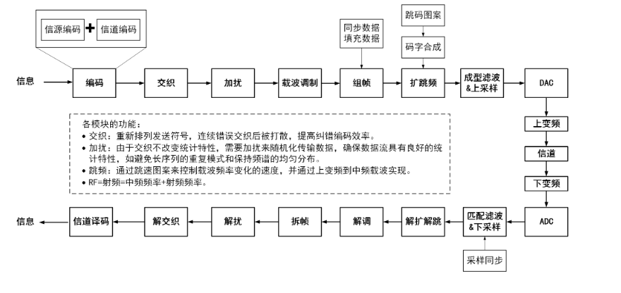

## 一、射频信号  
> 指频率范围在射频波段内的电信号，通常其频率范围从几千赫兹（kHz）到几百吉赫兹（GHz）。射频波段的具体范围没有严格的界定，但一般指的是频率高于音频信号（大约20 Hz到20 kHz），但低于微波频率（通常认为从1 GHz开始）的电磁波。  

## 二、无线通信系统  
无线通信系统通常包括以下主要步骤，这些步骤共同工作以实现信息的无线传输：
1. **信息源**：这是通信过程的起点，可以是文本、语音、视频或其他类型的数据。
2. **信源编码（Source Encoding）**：将信息源转换为适合传输的格式。例如，在语音通信中，模拟语音信号被数字化。
3. **数据成型（Data Formatting）**：将编码后的数据组织成一定的格式，如分组、帧等。
4. **调制（Modulation）**：将数字或模拟数据转换为适合在无线信道上传输的信号形式。常见的调制方式包括调幅（AM）、调频（FM）、调相（PM）以及更复杂的数字调制技术如QAM、FSK等。
5. **上混频（Upconversion）**：
   - **模拟上混频**：将基带信号与一个高频载波信号混合，将信号频率提升到射频（RF）范围。
   - **数字上混频**：在数字信号处理中，将数字基带信号与数字载波信号混合，然后通过数模转换器（DAC）转换成模拟信号。
6. **功率放大（Power Amplification）**：增加信号的功率，以便信号能够有效地传输到远距离。
7. **天线发射（Transmission）**：通过天线将射频信号发射到空间中。
8. **无线传播（Propagation）**：信号在空间中传播，可能受到衰减、反射、折射、散射和多径效应的影响。
9. **天线接收（Reception）**：在接收端，天线捕捉到传播来的信号。
10. **下混频（Downconversion）**：
    - **模拟下混频**：将接收到的射频信号与本地振荡器信号混合，降低信号频率到基带或中频范围。
    - **数字下混频**：在数字信号处理中，将模拟信号通过模数转换器（ADC）转换成数字信号，然后与数字本地振荡器信号混合。
11. **信号解调（Demodulation）**：将调制过的信号还原成原始的数据流。
12. **数据解包（Data Unpacking）**：从接收到的数据格式中提取出有用的信息。
13. **信源解码（Source Decoding）**：将接收到的编码数据还原成原始信息，例如将数字语音信号转换为模拟语音信号。
14. **信息接收端**：这是通信过程的终点，用户或设备接收到原始信息。  
这些步骤中的每一个都可能包含多个子步骤和复杂的处理过程，尤其是在现代无线通信系统中，如蜂窝网络、无线局域网（WLAN）、蓝牙等，它们使用高级的信号处理技术来提高数据传输的效率和可靠性。

## 三、积化和差
积化和差公式是三角函数中用于将两个三角函数的乘积转换为和或差的形式的一组公式。以下是基本的积化和差公式：
1. **和差化积公式**：
   - \(\sin A \cos B = \frac{1}{2}[\sin(A + B) + \sin(A - B)]\)
   - \(\cos A \sin B = \frac{1}{2}[\sin(A + B) - \sin(A - B)]\)
   - \(\cos A \cos B = \frac{1}{2}[\cos(A + B) + \cos(A - B)]\)
   - \(\sin A \sin B = -\frac{1}{2}[\cos(A + B) - \cos(A - B)]\)
2. **积化和差公式**：
   - \(\sin A + \sin B = 2 \sin\left(\frac{A + B}{2}\right) \cos\left(\frac{A - B}{2}\right)\)
   - \(\sin A - \sin B = 2 \cos\left(\frac{A + B}{2}\right) \sin\left(\frac{A - B}{2}\right)\)
   - \(\cos A + \cos B = 2 \cos\left(\frac{A + B}{2}\right) \cos\left(\frac{A - B}{2}\right)\)
   - \(\cos A - \cos B = -2 \sin\left(\frac{A + B}{2}\right) \sin\left(\frac{A - B}{2}\right)\)
这些公式在数学分析、工程学以及物理学等领域中非常有用，特别是在处理振动、波动以及信号处理等问题时。通过这些公式，可以将复杂的三角函数乘积简化为更易于处理的形式。

-------
欧拉公式是复分析中的一个重要公式，它将复指数函数与三角函数联系起来。欧拉公式表述为：
\[ e^{ix} = \cos x + i \sin x \]
其中，\( e \) 是自然对数的底数（约等于2.71828...），\( i \) 是虚数单位，满足 \( i^2 = -1 \)，而 \( x \) 是一个实数。
我们可以使用欧拉公式来解释积化和差公式。以下是如何使用欧拉公式证明 \(\sin A \cos B = \frac{1}{2}[\sin(A + B) + \sin(A - B)]\)：
1. 首先，我们将 \( \cos x \) 和 \( \sin x \) 表达为复指数函数的形式：
   \[ \cos x = \frac{e^{ix} + e^{-ix}}{2} \]
   \[ \sin x = \frac{e^{ix} - e^{-ix}}{2i} \]
2. 接下来，我们用复指数函数表示 \( \sin A \cos B \)：
   \[ \sin A \cos B = \left( \frac{e^{iA} - e^{-iA}}{2i} \right) \left( \frac{e^{iB} + e^{-iB}}{2} \right) \]
3. 展开这个乘积：
   \[ \sin A \cos B = \frac{1}{4i} \left( e^{iA}e^{iB} + e^{iA}e^{-iB} - e^{-iA}e^{iB} - e^{-iA}e^{-iB} \right) \]
4. 现在使用指数法则 \( e^{ix}e^{iy} = e^{i(x+y)} \) 和 \( e^{ix}e^{-iy} = e^{i(x-y)} \) 来简化表达式：
   \[ \sin A \cos B = \frac{1}{4i} \left( e^{i(A+B)} + e^{i(A-B)} - e^{i(B-A)} - e^{-i(A+B)} \right) \]
5. 注意到 \( e^{i(B-A)} = e^{-i(A-B)} \)，因此我们可以将上式中的第三项替换为 \( -e^{-i(A-B)} \)：
   \[ \sin A \cos B = \frac{1}{4i} \left( e^{i(A+B)} + e^{i(A-B)} - e^{-i(A-B)} - e^{-i(A+B)} \right) \]
6. 将上式中的 \( e^{i(A+B)} \) 和 \( e^{-i(A+B)} \) 以及 \( e^{i(A-B)} \) 和 \( e^{-i(A-B)} \) 分别组合起来，并且注意到 \( e^{-ix} = \cos(-x) + i\sin(-x) = \cos x - i\sin x \)：
   \[ \sin A \cos B = \frac{1}{4i} \left( (e^{i(A+B)} - e^{-i(A+B)}) + (e^{i(A-B)} - e^{-i(A-B)}) \right) \]
7. 最后，将 \( \sin x \) 的定义代入：
   \[ \sin A \cos B = \frac{1}{4i} \left( 2i\sin(A+B) + 2i\sin(A-B) \right) \]
   \[ \sin A \cos B = \frac{1}{2} \left( \sin(A+B) + \sin(A-B) \right) \]
这就完成了使用欧拉公式对积化和差公式的证明。通过这种方式，我们可以看到复数和三角函数之间的深刻联系。  

## 四、变频和混频的区别  
变频通常指的是整个信号频率转换的过程，可能包括混频、滤波、放大等多个步骤。
混频则更具体地指信号频率转换过程中的一个步骤，即将信号与一个本地振荡器信号相乘，以实现频率的搬移。

- 上变频（Upconversion）与上混频（Uplinking Mixing）
上变频通常指的是将基带信号或中频信号通过调制过程转换到更高的射频（RF）频段，以便发射。这个过程可能包括混频，但不仅仅限于此。上变频可能涉及以下步骤：  

调制：将基带信号与一个高频载波信号结合，产生调制信号。
混频：将信号与一个本地振荡器（LO）信号混频，以搬移到更高的频率。
上混频则更多地指的是在通信系统中，特别是在卫星通信中，将信号从地面站转换到卫星的传输频段。这个过程中混频是一个关键步骤，但它侧重于信号的传输方向，即从地面到卫星。

- 下变频（Downconversion）与下混频（Downlinking Mixing）
下变频是指将接收到的射频信号通过混频过程转换到较低的中频或基带，以便于信号处理和分析。这个过程通常涉及以下步骤：
混频：将接收到的射频信号与一个本地振荡器（LO）信号混频，以降低其频率。
滤波和解调：对混频后的信号进行滤波和解调，提取原始信息。
下混频则更多地指的是在通信系统中，将卫星传输的信号转换到地面站可以处理的频率。这个过程同样侧重于信号的传输方向，即从卫星到地面。

## 五、复数  
> 复数是实数的扩展，通常表示为 \( a + bi \)，其中 \( a \) 是实部，\( b \) 是虚部，而 \( i \) 是虚数单位，满足 \( i^2 = -1 \)。复数的计算遵循特定的规则，下面是一些基本的复数运算：
### 加法和减法
复数的加法和减法是将实部和虚部分别相加或相减。
如果 \( z_1 = a + bi \) 和 \( z_2 = c + di \)，那么：
- 加法：\( z_1 + z_2 = (a + c) + (b + d)i \)
- 减法：\( z_1 - z_2 = (a - c) + (b - d)i \)
### 乘法
复数的乘法遵循分配律，并且要记住 \( i^2 = -1 \)。
\( z_1 \times z_2 = (a + bi)(c + di) = ac + adi + bci + bdi^2 = (ac - bd) + (ad + bc)i \)
### 除法
复数的除法需要用到共轭复数来消除分母中的虚部。如果 \( z_1 = a + bi \)，其共轭复数是 \( \bar{z_1} = a - bi \)。
要计算 \( \frac{z_1}{z_2} \)，首先将 \( z_2 \) 的共轭乘以 \( z_1 \) 和 \( z_2 \) 的分子和分母：
\( \frac{z_1}{z_2} = \frac{a + bi}{c + di} \times \frac{c - di}{c - di} = \frac{(ac + bd) + (bc - ad)i}{c^2 + d^2} \)
结果可以表示为：
\( \frac{z_1}{z_2} = \frac{ac + bd}{c^2 + d^2} + \frac{bc - ad}{c^2 + d^2}i \)
### 模
复数的模（或绝对值）是复数在复平面上到原点的距离，计算为：
\( |z| = \sqrt{a^2 + b^2} \)
### 幂和根
复数的幂和根也是可能的，但通常涉及欧拉公式 \( e^{i\theta} = \cos(\theta) + i\sin(\theta) \) 和极坐标形式 \( z = re^{i\theta} \)。
- 幂：\( z^n = (re^{i\theta})^n = r^n e^{in\theta} \)
- 根：\( z^{1/n} = r^{1/n} e^{i(\theta + 2k\pi)/n} \)，其中 \( k = 0, 1, ..., n-1 \)
涉及共轭的公式主要包括以下几个：
1. **共轭复数的定义**：
   如果 \( z = a + bi \) 是一个复数，那么它的共轭复数 \( \bar{z} \) 定义为 \( \bar{z} = a - bi \)。
2. **复数与它的共轭的乘积**：
   \( z \cdot \bar{z} = (a + bi)(a - bi) = a^2 + b^2 \)
   这个公式可以用来计算复数的模的平方，因为 \( |z|^2 = z \cdot \bar{z} \)。
3. **复数除以它的共轭**：
   \( \frac{z}{\bar{z}} = \frac{a + bi}{a - bi} \)
   这个表达式通常用于将复数的分母实部化，但需要注意的是，只有当 \( z \) 不为零时，这个除法才有意义。
4. **共轭的性质**：
   - \( \overline{z + w} = \bar{z} + \bar{w} \)
   - \( \overline{z - w} = \bar{z} - \bar{w} \)
   - \( \overline{zw} = \bar{z} \cdot \bar{w} \)
   - \( \overline{\left(\frac{z}{w}\right)} = \frac{\bar{z}}{\bar{w}} \) （这里假设 \( w \neq 0 \)）
   - \( \overline{\bar{z}} = z \)
   - \( |z| = |\bar{z}| \)
5. **共轭在复数除法中的应用**：
   当我们需要计算 \( \frac{z}{w} \) 时，其中 \( w = c + di \) 且 \( c, d \) 为实数，我们可以乘以 \( w \) 的共轭来消除分母中的虚部：
   \( \frac{z}{w} = \frac{z}{c + di} \cdot \frac{c - di}{c - di} = \frac{z(c - di)}{w \cdot \bar{w}} = \frac{z(c - di)}{c^2 + d^2} \)
这些公式在复数的运算中非常有用，尤其是在处理复数的除法和化简表达式时。

